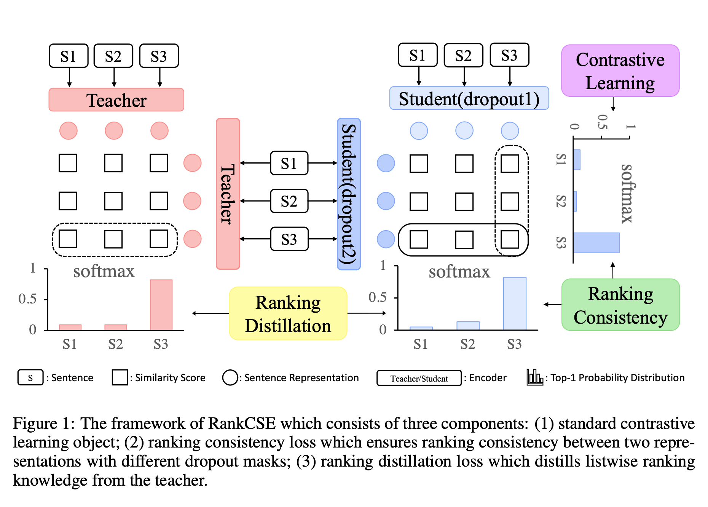

# RankCSE: Unsupervised Sentence Representation Learning via Learning to Rank

[](https://opensource.org/licenses/MIT)

This is a community implementation of RankCSE, released to facilitate research. I am not affiliated with the authors. The repo is based largely on [SimCSE](https://github.com/princeton-nlp/SimCSE).

## Overview


## Setups

[](https://www.python.org/downloads/release/python-386/)
[](https://pytorch.org/get-started/previous-versions/)

### Requirements

First, install PyTorch by following the instructions from [the official website](https://pytorch.org). 

```bash
pip install torch==1.7.1+cu110 -f https://download.pytorch.org/whl/torch_stable.html
```

If you instead use **CUDA** `<11` or **CPU**, install PyTorch by the following command,

```bash
pip install torch==1.7.1
```

Then run the following script to install the remaining dependencies,

```bash
pip install -r requirements.txt
```

### Download the pretraining dataset
```
cd data
bash download_wiki.sh
```

### Download the downstream dataset
```
cd SentEval/data/downstream/
bash download_dataset.sh
```

## Training
(The same as `run_rankcse.sh`.)
```bash
python train.py \
    --model_name_or_path bert-base-uncased \
    --train_file data/wiki1m_for_simcse.txt \
    --output_dir runs/my-rankcse-listmle-bert-base-uncased \
    --num_train_epochs 1 \
    --per_device_train_batch_size 128 \
    --learning_rate 3e-5 \
    --max_seq_length 32 \
    --evaluation_strategy steps \
    --metric_for_best_model stsb_spearman \
    --load_best_model_at_end \
    --eval_steps 125 \
    --pooler_type cls \
    --mlp_only_train \
    --overwrite_output_dir \
    --temp 0.05 \
    --do_train \
    --do_eval \
    --fp16 \
    --first_teacher_name_or_path voidism/diffcse-bert-base-uncased-sts \
    --second_teacher_name_or_path princeton-nlp/unsup-simcse-bert-large-uncased \
    --distillation_loss listmle \
    --alpha_ 0.33 \
    --beta_ 1.0 \
    --gamma_ 1.0 \
    --tau2 0.05
```

Our new arguments:
* `--<first/second>_teacher_name_or_path`: the model name of of the teachers for distilling ranking information. In the paper, two teachers are used, but we provide functionality for one or two (just don't set the second path).
* `--distillation_loss`: whether to use the ListMLE or ListNet problem formulation for computing distillation loss. 
* `--alpha_`: in the paper, alpha is used to balance the ground truth similarity scores produced from two teachers, ie. alpha * teacher_1_rankings + (1 - alpha) * teacher_2_rankings. Unused if only one teacher is set.
* `--beta_`: weight/coefficient for the ranking consistency loss term
* `--gamma_`: weight/coefficient for the ranking distillation loss term
* `--tau2`: temperature for softmax computed by teachers. If ListNet is set, tau3 is set to tau2 / 2 by default, as suggested in the paper. 


Arguments from [SimCSE](https://github.com/princeton-nlp/SimCSE):
* `--train_file`: Training file path (`data/wiki1m_for_simcse.txt`). 
* `--model_name_or_path`: Pre-trained checkpoints to start with such as BERT-based models (`bert-base-uncased`, `bert-large-uncased`, etc.) and RoBERTa-based models (`RoBERTa-base`, `RoBERTa-large`).
* `--temp`: Temperature for the contrastive loss. We always use `0.05`.
* `--pooler_type`: Pooling method.
* `--mlp_only_train`: For unsupervised SimCSE-based models, it works better to train the model with MLP layer but test the model without it.

## Evaluation

You can run the commands below for evaluation after using the repo to train a model:

```bash
python evaluation.py \
    --model_name_or_path <your_output_model_dir> \
    --pooler cls_before_pooler \
    --task_set <sts|transfer|full> \
    --mode test
```

For more detailed information, please check [SimCSE's GitHub repo](https://github.com/princeton-nlp/SimCSE).


## Pretrained models

[](https://huggingface.co/perceptiveshawty)

* RankCSE-ListMLE-BERT-base (reproduced): https://huggingface.co/perceptiveshawty/rankcse-listmle-bert-base-uncased
* RankCSE-ListNet-BERT-base (reproduced): https://huggingface.co/perceptiveshawty/rankcse-listnet-bert-base-uncased

We can load the models using the API provided by [SimCSE](https://github.com/princeton-nlp/SimCSE). 
See [Getting Started](https://github.com/princeton-nlp/SimCSE#getting-started) for more information.

## Citations

Please cite RankCSE and SimCSE if you use this repository or find it useful in some way. If you are the anonymous authors of the ICLR submission, feel free to contact me
at sach.chanchani [at] gmail.com about any concerns, or updating the citations. 

```bibtex
@inproceedings{liu2023rankcse,
    title = {{R}ank{CSE}: Unsupervised Sentence Representations Learning via Learning to Rank},
    author = {Liu, Jiduan  and
      Liu, Jiahao  and
      Wang, Qifan  and
      Wang, Jingang  and
      Wu, Wei  and
      Xian, Yunsen  and
      Zhao, Dongyan  and
      Chen, Kai  and
      Yan, Rui},
    booktitle = {Proceedings of the 61st Annual Meeting of the Association for Computational Linguistics (Volume 1: Long Papers)},
    year = {2023},
    publisher = {Association for Computational Linguistics},
}


@inproceedings{gao2021simcse,
   title={{SimCSE}: Simple Contrastive Learning of Sentence Embeddings},
   author={Gao, Tianyu and Yao, Xingcheng and Chen, Danqi},
   booktitle={Empirical Methods in Natural Language Processing (EMNLP)},
   year={2021}
}
```
